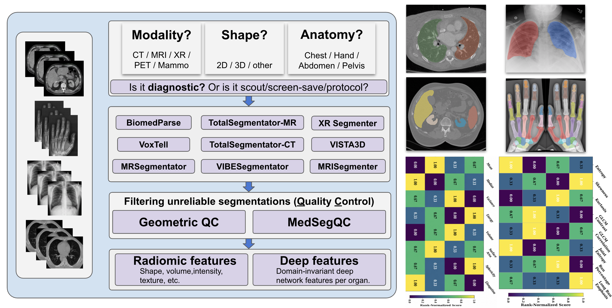

<div align="center">

## You See Voxels, I See Features: <br> A Unified Pipeline for Reliable Processing of Large-Scale Heterogeneous Clinical Imaging Data

[Soumitri Chattopadhyay](https://soumitri2001.github.io) · Basar Demir · Marc Niethammer

**[UCSD Biomedical Image Analysis Group](https://cseweb.ucsd.edu/~mniethammer/)**

</div>

---

The pipeline turns messy clinical imaging folders into standardized anatomical
masks, quality check (QC) summaries, and quantitative imaging features. It wraps multiple
segmentation foundation models behind a common interface, tracks long-running
batch jobs, and keeps outputs reproducible across modalities, anatomies, and
tool backends.

<div align="center">
  
</div>

### Highlights

- Batch processing for heterogeneous clinical filelists with persistent resume state.
- Lazy DICOM-to-NIfTI materialization for cases missing `image_nifti.nii.gz`.
- Anatomy-aware tool selection and QC target filtering for body, cardiac, spine, pelvis, and head studies.
- Integrated brain segmentation for CT/MRI head studies through SynthSeg.
- Two-stage downstream QC/radiomics: largest-volume GeometricQC, optional MedSegQC for supported CT/MRI abdominal organs, and PyRadiomics shape/first-order features.
- One wrapper contract for all tools: each tool writes binary per-organ masks into a canonical `segmentations_<tool>/` folder.

### Integrated Tools

Active segmentation backends include:

- TotalSegmentator CT/MR
- MRSegmentator
- MRISegmenter
- VIBESegmentator
- SynthSeg
- VISTA3D / NVSegmentCTMR
- VoxTell
- TextMedSeg3D / SAT

Deferred or optional integrations include BiomedParse2D/3D, nnInteractive, HybridGNet, cuRadiomics, and LLM-based planning/QC interpretation. Tool metadata lives in `config/tool_registry.json`.

### Repository Layout

- `orchestrator/`: single-case pipeline, batch runner, QC/radiomics runner, state tracking.
- `tools/`: model wrappers and subprocess runners.
- `processing/`: DICOM/NIfTI conversion, normalization, mask formatting, postprocessing.
- `qc/`: anatomy policy, geometric checks, MedSegQC integration.
- `radiomics/`: PyRadiomics extraction helpers.
- `config/`: paths, tool registry, constants, prompts, feature settings.
- `docs/`: detailed installation, deployment, extension, and parallelism notes.
- `external/`: third-party model repositories.
- `checkpoints/`: model weights, ignored by git.

### Installation

Clone the repository and populate external tool code:

```bash
git clone https://github.com/multimodal-ariel/visual-agentic-cdw.git
cd visual-agentic-cdw
git submodule update --init --recursive
```

Create isolated conda environments for each backend:

```bash
export PYTHONNOUSERSITE=1
bash scripts/setup_envs.sh
```

Download model checkpoints:

```bash
bash scripts/download_checkpoints.sh
```

Edit local paths in `config/constants.py`, especially:

```python
DICOM_ROOT = "/path/to/raw/dicom"
SEGMENTATION_ROOT = "/path/to/segmentation_outputs"
```

For full server setup, environment-specific fixes, and checkpoint notes, see `docs/installation.md` and `docs/deployment.md`.

### Quick Start

Run a segmentation batch over a JSON filelist of case directories:

```bash
conda run -n cdw_radiomics python -m orchestrator.batch_runner \
  --filelist new_data_paths/3d_volume_paths_interleaved.json \
  --gpus 0,1,2,3 \
  --workers 4 \
  --no-llm \
  --progress-every 50 \
  --log-level WARNING
```

The runner writes:

- `logs/pipeline_state_v3.json`: resumable per-case state.
- `logs/pipeline_results_v3.csv`: one row per attempted case.
- `{SEGMENTATION_ROOT}/.../segmentations_<tool>/`: per-tool masks.

Completed cases are skipped automatically on rerun. Add `--retry-failed` to retry failed cases.

### QC and Radiomics

After segmentation, run the downstream filtering and feature extraction pass:

```bash
conda run -n cdw_radiomics python orchestrator/batch_qc_radiomics_runner.py \
  --segmentation-state logs/pipeline_state_v3.json \
  --segmentation-root /path/to/segmentation_outputs \
  --gpus 0,1,2,3 \
  --workers 4 \
  --progress-every 50 \
  --log-level WARNING
```

Use `--watch` only when segmentation is still running and new completed cases are appearing in the state file.

Per-case QC outputs:

- `segmentations_filtered_GeometricQC/`: largest-volume anatomy-relevant masks.
- `segmentations_filtered_MedSegQC/`: MedSegQC-selected masks where applicable.
- `qc_scores.csv`: candidate masks, geometry checks, QC scores/errors.
- `radiomics_features.csv`: PyRadiomics shape and first-order features.
- `selection_summary.json`: selected masks and provenance.

MedSegQC is currently only used for supported CT/MRI abdominal organs (`liver`, `spleen`, `kidney_left`, `kidney_right`). PET/CT cases still receive GeometricQC/radiomics, but MedSegQC is skipped.

### Data Contract

Each case directory is expected to contain or be able to materialize:

```text
<case_path>/
  image_nifti.nii.gz
  segmentations_<tool>/
    <organ>.nii.gz
```

Masks should be binary, named by normalized organ name, and aligned to `image_nifti.nii.gz` unless the wrapper explicitly records/resolves geometry differences.

### Extending the Pipeline

To add a segmentation model:

1. Put third-party code under `external/<ToolName>/`.
2. Add a wrapper in `tools/<tool_name>.py` by subclassing `BaseSegmentationTool`.
3. Register output directories and conda envs in `config/constants.py`.
4. Add tool metadata to `config/tool_registry.json`.
5. Ensure outputs follow the canonical per-organ NIfTI contract.
6. Add a dry-run or minimal smoke test.

See `docs/adding_segmentation_tool.md` for the full checklist.

### Development Checks

```bash
conda run -n cdw_radiomics python orchestrator/batch_qc_radiomics_runner.py --self-test
conda run -n cdw_radiomics python -m pytest tests
```

For focused setup/debugging, see:

- `docs/installation.md`
- `docs/deployment.md`
- `docs/adding_segmentation_tool.md`
- `docs/PARALLELISM.md`

### Notes

- This repository tracks code and configuration only. Data, checkpoints, logs, and generated outputs should remain untracked.
- Tool environments are intentionally separate; a single unified Python environment is not expected to work.
- This is research software for large-scale clinical imaging analysis, not a medical device.
